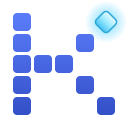
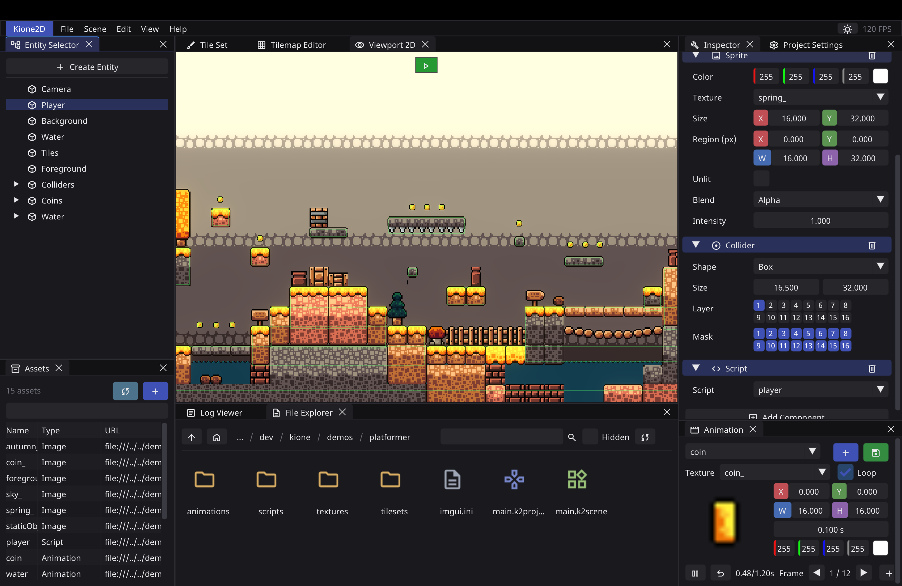
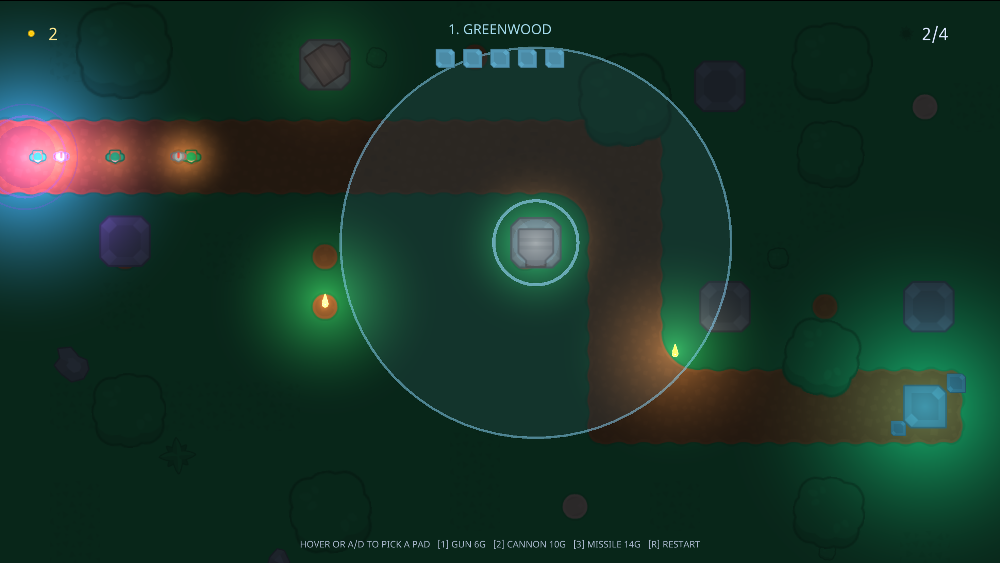

<h1>
    
    <span> kione </span>
</h1>

Kione is a general purpose 2D game engine. Build your game in its editor, script
it in Lua, and ship it by dropping a tiny runtime next to your project folder.



## Highlights

- Included Editor: a docking editor with scene/entity/component editing, live play mode,
  and built-in tileset, tilemap, and animation editors.
- Lua scripting: drive entities with small scripts: read input, move and animate, spawn
  and query, play sounds, switch scenes.
- Lit 2D rendering: batched sprites with ambient/point/spot/sprite lights, HDR + bloom,
  crisp text, and tilemaps.
- Readable projects: scenes and projects are plain YAML. Easy to diff, hand-edit, and
  generate.
- Easy deployment: the `player` runtime is self-contained.
  Put it next to your `.k2project` and the game runs anywhere.

A script looks like this:

```lua
local SPEED = 200

function on_update(self, dt)
    local t = self:transform()
    if Input.is_key_down(Key.left)  then t.translation.x = t.translation.x - SPEED * dt end
    if Input.is_key_down(Key.right) then t.translation.x = t.translation.x + SPEED * dt end

    for _, coin in ipairs(kione.find_all("Coin")) do
        if self:overlaps(coin) then
            coin:destroy()
            kione.play_sound("pickup")
        end
    end
end
```

## Documentation

The user manual lives at [gnikdroy.github.io/kione](https://gnikdroy.github.io/kione/).
Start with [Your First Game](https://gnikdroy.github.io/kione/guides/your-first-game/), a
step-by-step tutorial that assumes nothing.

## Getting started

Grab a [prebuilt release](https://github.com/gnikdroy/kione/releases) for Linux, macOS, or
Windows, unzip it, and run the `editor`.

Or build from source using CMake and a C++ compiler (Clang recommended); every
library is downloaded automatically:

```sh
git clone https://github.com/gnikdroy/kione.git
cd kione
cmake -B build
cmake --build build -j
```

This produces `editor`, `player`, and `K2_tests` in `build/bin/`.

## Try the demos

Two projects ship in `demos/`.

A small platformer demonstrates lit sprites, tilemap levels, animated coins, and a
Lua-scripted player:

```sh
./build/bin/editor demos/platformer/main.k2project   # open it in the editor
./build/bin/player demos/platformer/main.k2project   # just play it
```

Move with A/D or the arrow keys, jump with Space, and collect the coins.

Crystal Keep is a full tower-defense game: a five-level night-time campaign with enemy
waves, three tower types, dynamic lighting, a HUD, audio, and campaign
saves. It is built entirely as engine content (scenes + Lua), with no engine-side game code:

```sh
./build/bin/player demos/towerdefense/res/game.k2project
```



## Project layout

```
include/, src/   the engine library
editor/          the ImGui editor
player/          the standalone game runtime
demos/           example projects
docs/            the user manual
tests/           the test suite
```

Under the hood: C++23, OpenGL 4.1 core (macOS-compatible), EnTT, Lua 5.4 (sol2), GLFW,
miniaudio, and yaml-cpp.

## Contributing

Bug reports and small, focused improvements are very welcome. Kione is intentionally a
small engine. It isn't trying to compete with Godot or Unity, and proposals should
keep it approachable and easy to read.

## License

[LGPL-3.0](LICENSE)
