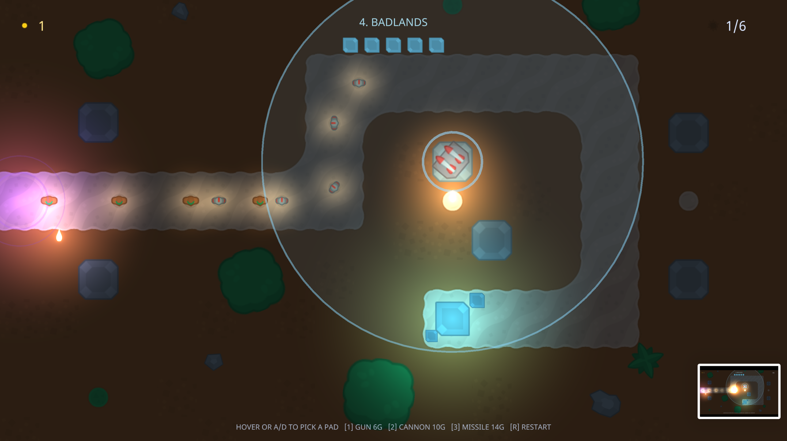

## Demos

Two finished projects ship in the repository's `demos/` folder. They're the best way to see
the engine, the editor, and the scripting API working together — and great things to pick
apart when you wonder "how would I do X?".

### Platformer

A small side-scroller with lit sprites, tilemap levels, animated coins, and a Lua-scripted
player. Open it in the editor or play it directly:

```sh
./editor demos/platformer/main.k2project
./player demos/platformer/main.k2project
```

**Controls** — move with **A/D** or the **arrow keys**, jump with **Space**, **W**, or **Up**,
and walk into coins to collect them (watch the Log Viewer count them).

### Things to try

Each of these takes a minute and teaches you a corner of the editor:

- **Select the player** in the Entity Selector and look at the Inspector — a real character is
  just a Sprite, a Collider, and a Script.
- **Open `scripts/player.lua`** in a text editor. In ~100 lines it covers input, gravity,
  jumping, collision, and coin pickup — all with the functions from the
  [Scripting](../scripting/) page. Change `JUMP_SPEED` at the top, press play, and feel the
  difference.
- **Paint the level**: select a tilemap entity, open the
  [Tilemap Editor](../windows/#tilemap-editor), and add a platform. Press play and stand on
  it.
- **Change the mood**: find the Environment component (on the camera) and lower
  `ambient_intensity` — the scene falls into darkness, and the lights suddenly matter.
- **Break something on purpose**: add a typo to `player.lua` and press play. See how the error
  appears in the Log Viewer? That's your debugging loop.

Remember: play mode runs on a copy of the scene, so experiment freely — stopping undoes
everything that happened while playing.

### Crystal Keep



A complete five-level tower-defense campaign, built entirely as kione content. There is no
engine-side game code. Every map is an autotiled TileMap, every unit and effect comes from one
spritesheet, the HUD and health bars are drawn primitives, all audio is procedurally
generated, and the waves, economy, and campaign flow are ~15 small Lua scripts:

```sh
./editor demos/towerdefense/res/game.k2project
./player demos/towerdefense/res/game.k2project
```

Controls: hover or A/D picks a build pad, 1/2/3 builds a gun, cannon, or missile
tower, R retries a level. Gun turrets hit air, cannons splash ground, missiles home.
Progress saves between runs.

It shows the engine's systems at full stretch: night scenes lit by campfires, headlights, and
muzzle flashes; six enemy types including composite tanks (a turret entity riding a hull) and
bombers with drawn ground shadows.

## Contributing

Contributions are welcome! We happily take:

- **Bug reports** — the more reproducible, the better.
- **Small, meaningful feature requests** and implementations.

Kione is intentionally a **small hobby engine** — it is not trying to compete with Godot or
Unity. Please keep proposals in that spirit: focused, self-contained improvements that keep the
engine approachable and easy to read.
